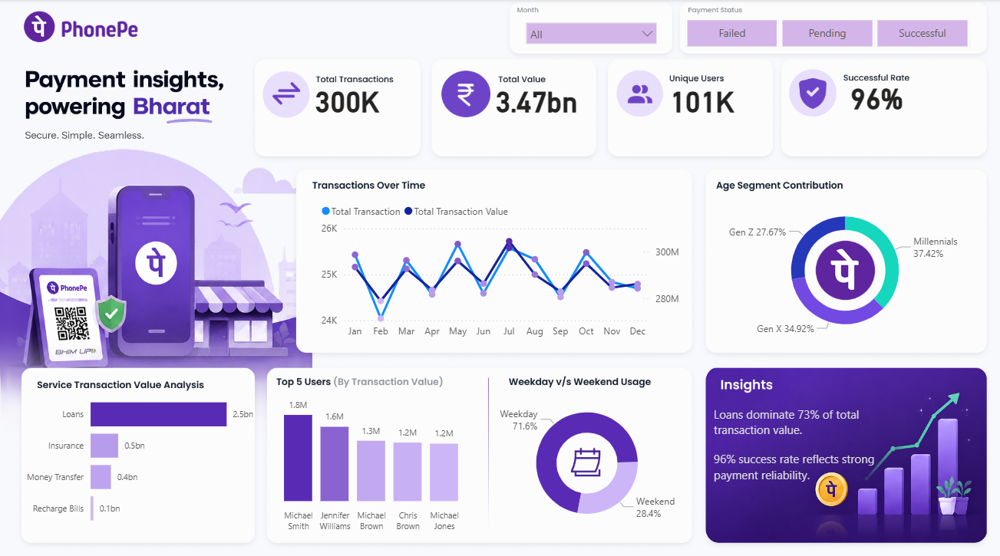

# PhonePe Payment Analytics Dashboard

An interactive Power BI dashboard analysing PhonePe payment transaction data to uncover trends in revenue, user behaviour, and service performance.

---

## Dashboard Preview

---

## Project Overview

This project simulates a real-world payment analytics use case inspired by PhonePe. The goal was to build an end-to-end BI solution — from raw data to a fully interactive dashboard — covering data modelling, DAX calculations, and visual design.

---

## Tech Stack

- **Power BI Desktop** — Dashboard development
- **DAX** — Custom measures and time intelligence
- **Power Query** — Data cleaning and transformation
- **Excel** — Data source
- **Figma** — Dashboard layout design

---

## Data Model

Star Schema with 3 tables:

- `All_Transactions` (Fact Table) — Amount, Date, Payment Status, Service, User ID
- `All_Users` (Dimension Table) — User ID, Name, Age, Age Segment, Join Date
- `Date_Table` (Dimension Table) — Date, Month, Quarter, Weekday, Weekend

---

## DAX Measures

| Measure | Description |
|---|---|
| Total Transaction | COUNT of all transactions |
| Total Transaction Value | SUM of all amounts |
| Total Users | DISTINCTCOUNT of User IDs |
| Successful Transaction | CALCULATE with Payment Status filter |
| Success Rate | DIVIDE of successful vs total |
| Trans Value PM | DATEADD previous month value |
| Total Trans PM | DATEADD previous month count |
| Trans Value MOM% | Month-on-month % change in value |
| Total Trans MOM% | Month-on-month % change in count |

---

## Key Insights

- Loans dominate 73% of total transaction value across all services
- 96% success rate reflects strong payment system reliability
- Millennials represent the largest user segment at 37.42%
- May recorded peak transactions at 25,659

---

## Dashboard Features

- KPI Cards with MOM% growth indicators
- Dual-axis line chart for transaction trends over time
- Donut charts for age segment and weekday vs weekend analysis
- Bar charts for service-wise and top user analysis
- Interactive slicers for Month and Payment Status filtering

---

## Project Purpose

This is an educational portfolio project built to demonstrate Power BI, DAX, and data modelling skills. Data is synthetically generated and does not represent actual PhonePe transaction data.
